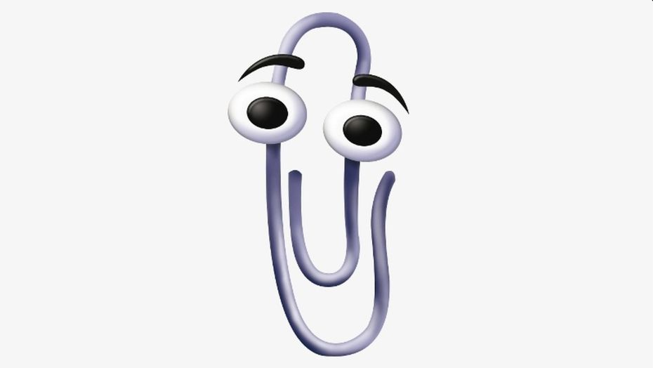

# Clippy AI 📎

**The world's most annoying AI assistant is back. Clippy meets Claude Code.**

Remember Clippy? The paperclip that haunted every Word document from 1997 to 2007? He's back. And this time, he's watching your AI write code.

Clippy AI is a transparent desktop overlay that reacts to everything Claude Code does -- across all your sessions. He floats on top, plays authentic animations, gives unsolicited advice, and absolutely refuses to leave you alone.

Just like the good old days.

<p align="center">
  
</p>

---

## One-liner Install

```bash
npx clippy-ai
```

Or if you like doing things the hard way:

```bash
git clone https://github.com/producer102/clippy-ai.git
cd clippy-ai
npm run setup    # install deps + build + install Claude Code hooks
npm start        # unleash the paperclip
```

## Features

- **Real Clippy** -- Authentic animations from the original clippyjs library. He taps, he waves, he judges you.
- **Always on top** -- Transparent overlay that follows you everywhere. No escape.
- **Multi-session aware** -- Works with ALL your Claude Code instances (VSCode + Terminal). He sees everything.
- **Context-aware commentary** -- Reads your conversation and comments on what you're doing. Poorly.
- **Unsolicited tips** -- Random advice every 45-90 seconds. You didn't ask. He doesn't care.
- **Error memory** -- Recognizes repeated errors. "This error again? Really?"
- **Progress tracking** -- Shows step count and duration, so you know exactly how long you've been suffering.
- **Click-to-focus** -- Single click brings your editor to the foreground. The one useful feature.
- **Double-click quips** -- Context-aware jokes about your current session. Comedy gold (citation needed).
- **i18n** -- Auto-detects system language (English / German). Annoying in two languages.
- **Autostart** -- Launches with Windows. You're welcome.
- **Sleeps when idle** -- Wakes up INSTANTLY when you send a message. He was watching the whole time.

## Commands

| Command | Description |
|---------|-------------|
| `npm run setup` | Install deps, build, install Claude Code hooks |
| `npm start` | Launch Clippy AI |
| `npm run build` | Rebuild renderer bundle |
| `npm run install-hooks` | Install Claude Code hooks only |
| `npm run uninstall` | Remove all Claude Code hooks (he'll be back) |

## Interactions

| Action | Result |
|--------|--------|
| **Single click** | Focus VSCode / Terminal window |
| **Double click** | Context-aware quip about your current session |
| **Drag** | Move Clippy AI anywhere on screen |
| **System tray** | Show / Hide / Quit (but why would you?) |

## How It Works

1. **Claude Code Hooks** in `~/.claude/settings.json` fire on every tool use, task completion, and user prompt
2. Hooks send events via HTTP to the Clippy AI Electron overlay (port 19542)
3. Clippy AI plays animations, shows speech bubbles, and tracks your session context
4. Clippy AI sleeps when nothing is happening and wakes up instantly -- like a cat that heard a can opener

## Why?

Because every developer tool ecosystem eventually gets a Clippy. It's a law of nature.

Also because watching an AI write code while a cartoon paperclip judges both of you is peak 2026.

## Requirements

- Node.js 18+
- Electron (installed via npm)
- Claude Code (CLI or VSCode extension)
- Windows 10/11 (macOS/Linux: contributions welcome!)
- A sense of humor

## Contributing

PRs welcome! Some ideas:

- Linux support
- More animations and reactions
- Additional languages
- Custom Clippy skins
- Even more annoying tips

## Disclaimer

Clippy AI is not affiliated with Microsoft or Anthropic. The original Clippy character is property of Microsoft. This is a fan project built with love, nostalgia, and questionable judgment.

## License

[CC BY-NC 4.0](LICENSE) - Free for non-commercial use. Want to use it commercially? Open an issue, let's talk.
